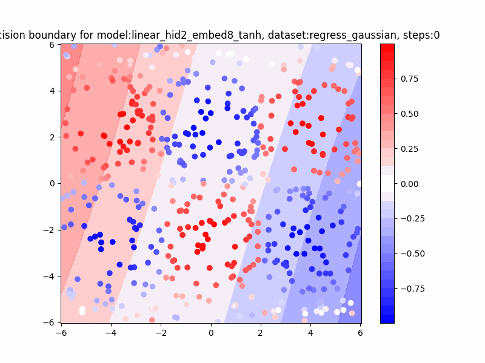
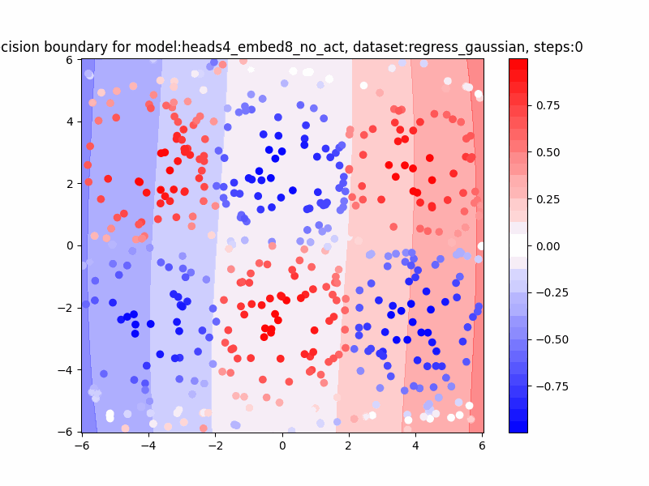

# README

Attention Here❗❗❗ This repository focus on how to use attention mechanism to apply on some simple task like regression and classification, hope to grasp some intuitions.

- run on CPU

```bash
pip install torch einops
```

## Datasets

- regression: gaussian, plane

<table>
    <tr>
        <td colspan="1" align=center>
            
        </td>
        <td colspan="1" align=center>
            
        </td>
    </tr>    
</table>

- classification: circle, spiral, two_gaussians, xor

<table>
    <tr>
        <td colspan="1" align=center>
            
        </td>
        <td colspan="1" align=center>
            
        </td>
    </tr>    
    <tr>
        <td colspan="1" align=center>
            
        </td>
        <td colspan="1" align=center>
            
        </td>
    </tr>
</table>

## Model

- take regress gaussian as example
- MLP: 2 hidden layer, 32 hidden units (105 para), tanh activation 
- Heads: 1 hidden layer, 8 hidden units (**33** para), **no activation** 

| Model | Final Output | Hidden |
| :---: | :---: | :---: |
| MLP |  |  |
| Heads |  |  |