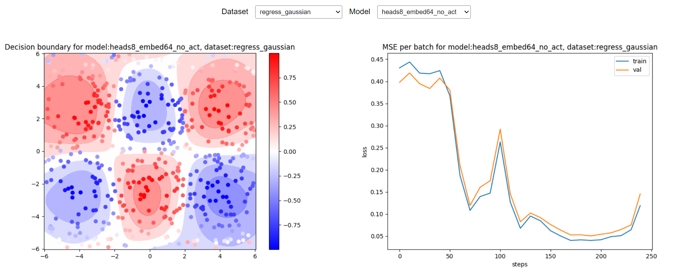

# README

Attention Here❗❗❗ This repository focus on how to use attention mechanism to apply on some simple task like regression and classification, hope to grasp some intuitions.

- run on CPU

```bash
pip install torch einops
```

## Datasets

Refer to the [neural network playground](https://playground.tensorflow.org/) of tensorflow, and I find this website datasets generated by typescript `dataset.ts`. So I use numpy implement the same function [here](dataset.py).

- regression: plane, gaussian
- classification: circle, spiral, two_gaussians, xor


<table>
    <tr>
        <th>plane</th>
        <th>gaussian</th>
        <th>circle</th>
        <th>spiral</th>
        <th>two_gaussians</th>
        <th>xor</th>
    </tr>
    <tr>
        <td colspan="1" align=center>
            
        </td>
        <td colspan="1" align=center>
            
        </td>
        <td colspan="1" align=center>
            
        </td>
        <td colspan="1" align=center>
            
        </td>
        <td colspan="1" align=center>
            
        </td>
        <td colspan="1" align=center>
            
        </td>
    </tr>    
</table>


## Model

Here we provide two model, MLP and Heads, the difference is as follows:

- MLP: 2 hidden layer, 8 hidden units (105 para), tanh activation 
- Heads: 1 hidden layer, 8 hidden units (**33** para), **no activation** 

The two models above are implemented in [model.py](model.py), and the usage is as follows:

```python
# from model import Linear_Reg_Gaussian
from model import Heads_Reg

# model = Linear_Reg_Gaussian(input_dim, n_embd, output_dim)
model = Heads_Reg(input_dim, n_embd, n_head, output_dim)
```

## Train

- Adam optimizer with learning rate 3e-2, and MSE loss for regression, CrossEntropy loss for classification.
- 500 samples to train and 500 samples to validate.
- 64 batch size and 30 epochs to train.
- mostly, our config is as follows:

```python
train_samples = 500
val_samples = 500

noise = 0.2 
# a good para to test the model performance 
# set noise to 0.01 when train regress gaussian

batch_size = 64
num_epochs, eval_interval = 3, 1 
# 3,1 for regress_plane and classify_two_gaussians
# 30,10 for regress_gaussian, classify_circle, classify_xor
# 300,100 for classify spiral

learning_rate = 3e-2
```

- more code details can be found in [train.py](train.py)
- and you can use `git log` to check the my actual training code

## Visualize

We use the following gif to visualize the training process, the left is the final output, the right is the hidden state.

- We choose 2 relatively diffucult tasks in all 6 task, gaussian and spiral, to visualize the regression or classification training process.
- More code details can be found in [visualize_train/README.md](visualize_train/README.md)

### regress_gaussian

| Model | Final Output | Hidden |
| :---: | :---: | :---: |
| MLP |  |  |
| Heads |  |  |

### classify_spiral_data

| Model | Final Output | Hidden |
| :---: | :---: | :---: |
| MLP |  |  |
| Heads |  |  |

## Result

See [visualize/README.md](visualize/README.md) for more details.

